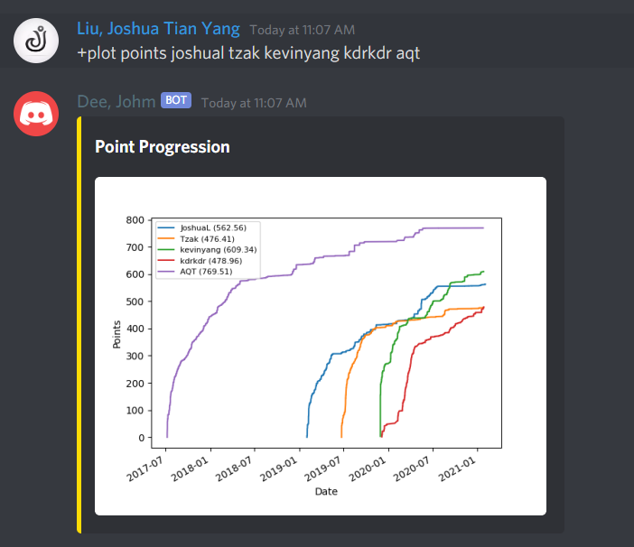
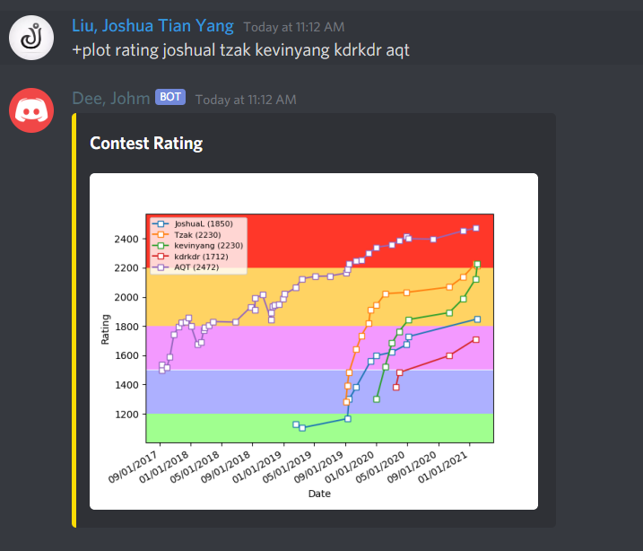
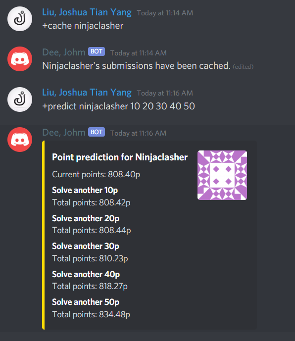

# JOMD
JOMD is a Discord bot for [Dmoj](https://dmoj.ca/) Inspired by [TLE](https://github.com/zzaria/tle)

## Previews
Point history



Rating history



Point prediction



# Features
The features of JOMD are split up into seperate cogs each handling their related commands.

```
Admin:
  cache_contests    Individually caches every contest
  force             Force a recache of a problem, or contest
  reload_all        Reload a module
  update_problems   Update all problems in db (For when Nick nukes problems)
Contest:
  contestDifficulty Calculate contest problem difficulty
  postcontest       Updates post-contest role
  ranklist          List rating predictions of a contest
ContestAnnouncements:
  contests          
  sub               
  subs              
  unsub             
Gitgud:
  gitgud            Recommend a problem and gain point upon completion
  gitlog            Show the past gitgud history of a user
  gotgud            Mark challenge as complete
  howgud            Returns total amount of gitgud points
  nogud             Cancels any unfinished challenge
Handles:
  link              Links your discord account to your dmoj account
  set               Manually link two accounts together
  top               Shows registered server members in ranked order
  unlink            Unlink your discord account with your dmoj account
  update_roles      Manually update roles
  whois             
Meta:
  cache             Caches the submissions of a user, will speed up other com...
  cachecontest      Update contest rating changes
  check             Check if the bot has been rate limited
  info              Bot info
  stats             Display cool dmoj stats that no one asked for
Plot:
  plot              Graphs for analyzing DMOJ activity
User:
  gimme             Recommend a problem
  predict           Predict total points after solving N pointer problem(s)
  solved            Shows a user's last solved problems
  user              Show user profile and latest submissions
  userinfo          Show user profile and latest submissions
  vc                Suggest a contest
​No Category:
  help              Shows this message
```

# Setup

To setup the bot first clone the repository and cd into it

```
git clone https://github.com/zzaria/JOMD.git
cd JOMD
```


Make sure you have python3.7 installed.

```
apt-get install python3.7
```

Install relevant packages

```
pip3.7 install -r requirements.txt
```

Creeate a `.env` file, with JOMD_BOT_TOKEN as the discord bot token and JOMD_TOKEN s the DMOJ api token

```
BOT_TOKEN=x
JOMD_TOKEN=x
```

**JOMD also uses SQLAlchemy as a orm and Alembic as a migration tool. You need to make sure the database is upto date**

**If you have cloned this repository before the addition of Alembic, find the corresponding hash in /alembic and run**

```
alembic stamp <HASH>
```

Then run

```
alembic upgrade head
```

Run the bot with

```
python3.7 Main.py
```


**Warning**: Many of the commands require multiple pieces of information to be fetched, so many initial commands will take several seconds to run but will speed up as more information is fetched and stored.

# Usage
To use the bot, use the `+` prefix

# Contributing
Pull requests are welcomed and encouraged.
